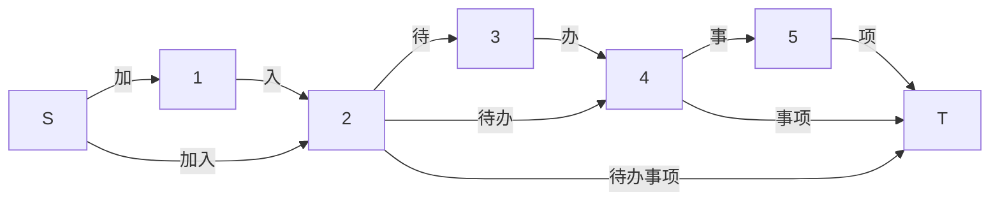

# Lab 4 Chinese Segmentation with DP

胡译文 2021201719

## 1. 需求分析

本实验要求实现中文分词。目前中文分词有两种方案，一种是经典的统计语言模型方案，另一种是更前沿的基于神经网络的方案。基于课程要求我们选用了统计语言模型的方案。我们**使用一个包含一个中文单词、频数和词性的词表来构建统计模型**；再利用改模型计算出最可能的分词方案。

```text
的 3188252 uj
了 883634 ul
是 796991 v
在 727915 p
和 555815 c
```


## 2. 概要设计

要计算分词，我们可以将各个字和词看成边，每个字之间虚拟一个节点。比如一句话 “加入待办事项” 用图可以表示成：



我们只需要根据输入构建每个节点间的边权即可。由于提供的数据并不多，设计一个尽可能有效的算法来弥补数据不足带来的问题，成为中文分词的其中之一关键。

在一般的正边权、无环图中，要求解最值路径，我们往往采用 Dijkstra 算法。采用优先队列的 Dijkstra 算法可以达到最坏 $O(n\log n)$ 的时间复杂度。

而在求解本题的最大值路径的过程中，我们发现我们得到的是一个**特殊的有向无环图** ── 每一条边一定从左到右。因此这可以看成一个**简单的背包模型**，在 $O(nm)$ 的时间复杂度内可以求解。


## 3. 详细设计

### 算法思想

计算一个句子分词的概率，可以采用 **BoW 词袋模型**的思想，将句子看成**分词结果的词的概率之积**。由于计算概率的积计算开销较大，一个惯用的思路是转化为对数概率计算和。因此我们将每个边的权重设置为词频的对数。在字典中不会出现频数为 0 的词。

但是我们发现 m 的大小往往远大于 n ── 往往标点符号已经是天然的分割，所以一个单句往往长度很小；但最后一个字相同的词平均有 12 个，但中位数仅有 1 个，1/4 位数也仅有 4 个。这表明样本分布极度不平均。如果直接采用背包算法将导致时间复杂度较高。因此我们采用 $O(n^2)$ 的**子字符串算法**。同时使用基于哈希的 `unordered_map` 快速查询每个子字符串是否存在以及存在时权重大小。

**我们形式化地表示一句话的分词结果和状态：**用 $w_{i,j}=c_i,c_{i+1},\cdots,c_j$ 表示由 $j-i+1$ 个字组成的词，$n_{i,j}$ 表示当前词在词表中出现的次数。为此，我们设 $dp_i$ 为 $c_0,c_1,\cdots,c_i$ 子句的最佳分割方法。边的权重采用了 $w_{i,j}=\ln n_{i,j} - \ln N + p_{i,j}$ 方式计算，其中 $N=\sum_{i\in Vocab}n_i$、人工设计的罚项 $p_{i,j}=\log_{10}\left(P\left\{length=j-i+1\right\}\right) / n_{i,j}$（推导过程详见下 [分词分数计算](# 分词分数计算) 部分）。

由此可以得到**状态转移方程** $dp_i = \max_{j<i}\{dp_j+w_{i,j}\}$。

此时总时间复杂度为 $O(n^2)$ ，$n$ 为输入单句的长度。

要进一步提升效率，我们可以发现词典中的句子有最大长度。将之作为循环时的最大次数，可以将时间复杂度降至 $O(n)$。至此，我们达到了中文分词的数据、效率和准确度的平衡。

### N 最短路径分词

要基于动态规划实现 N 最短路径分词，一个简单有效的策略就是维护前 N-1 条路径，再次查找最短路径且不同于前 N-1 条。可以使用一个二维数组维护这 N-1 条路径。由于每次分词都要查询 N-1 条路径，时间复杂度为 $O(n^2)$。

一个简单的优化策略类似于上文，为 N 最短路径的 N 寻找最大值，即寻找常数条最短路径。时间复杂度为 $O(n)$。

### 软件架构

```text
.
├── README.md       // 实验要求
├── Report.md       // 需求分析与实验报告
├── Report.pdf      // 需求分析与实验报告
└── sources
    ├── dict.txt    // 分词词典
    ├── SegCN.hpp   // 中文分词软件库
    ├── utils.hpp   // 工具函数库
    ├── main.cpp    // 主程序源文件
    ├── a.out       // 主程序二进制
    ├── gui.py      // GUI库
    └── test.sh     // 单元测试
```

分词模块作为 `hpp` 库文件独立于主程序文件。主程序调用分词库提供的接口，完成分词。

### 实现逻辑

`SegCN.hpp` 库中提供了一个 `Seg` 类，初始化时需要传入字典相对路径，默认为 `dict.txt`。调用 `segmentation` 方法，程序会将句子根据标点分割为子句，再将每个子句单独分词。`_punctuation` 成员定义了一个宽字符的正则表达式，修改该变量可以删改标点符号分割子句。

### GUI

为了简单起见，我们实现了一个简易的 GUI 操作界面。


点击 `提交` 即可完成分词。

## 4. 调试分析

### 中文

本地化（又称国际化）一直是 C++ 软件的一大问题。网上关于本地化的资料并不全面，虽然在大多数机器上都能正常运行，但由于电脑在环境变量 `LC_ALL` 和 `locale` 库兼容性上的问题，并不能正常运行。使用以下方法初始化，并采用 `wstring`, `wcin`, `wcout` 的一系列 STL 库，可以成功在文件和命令行读写中文。经测试，搭配 `to_wstring` ( `utils.hpp` 库中)，Mac 系统在不同语言环境下均可以正常使用中文。


### 分词分数计算

在调试过程中遇到了一些问题，比如无法正确分词。具体而言体现在分数计算问题上：


**在每个字处切开，都被认为有更高的分数**，因此分词结果为“测/试/中/文/分/词”。这是因为最初，我将对数频数 $\ln n_i$ 直接作为了该词的分数。最终，在参阅 BYVoid 的 [基於統計語言模型的拼音輸入法](https://byvoid.github.io/slides/slmpime/index.html)，发现因为不同分词方案词个数不同，$\ln N$ 会对结果产生影响，因此修正了分数计算公式：

$$\begin{align*}P^\ast=-\ln P=-\sum_{i\in S}\ln P(w_i)\approx -\sum_{i\in S}\ln\frac{n_i}{N}=\sum_{i\in S}[-\ln n_i+\ln N]\end{align*}$$

在词表中，**长尾词的统计偏差往往很大**。因此我们引入“罚项”来弥补数据不足，导致的频率近似概率时，所产生的误差。如果该词没有出现在词表中，则给予较大罚项。为了平滑曲线，使用 $e^{-\log_{10} n_{i,j}}$ 作为系数。

$$p_{i,j}=e^{-\log_{10} n_{i,j}}\times \log(n_{\{length=j-i+1\}}/N)\approx\log_{10}\left(P\left\{length=j-i+1\right\}\right) / n_{i,j}$$

此外，**词表中词频过高的词**往往会极大影响实验结果，因此我们对于词频在 $10000$ 以上的部分做了根方运算处理，以限制最大词频的影响。

为了尽可能使得分词结果正确，我们反复调整了其中的参数，最终呈现出以上结果。在实验过程中我们深刻体会，可以帮助我们摆脱反复调整数据，也是机器学习算法被高度重视的原因之一。

### 时间测试

经测试，使用 `unordered_map` 构建索引平均用时 $0.2$ 秒。分词平均用时 $0.005$ 秒。


### 调试

在编译过程中定义宏变量 `DEBUG` 可以将输出中间参数信息。


## 5. 用户使用说明

将主体分词库 `SegCN.hpp`、工具库`utils.hpp`、词典文件`dict.txt`以及测试用的 `main.cpp` 放置于同一目录下，使用 C++17 编译并运行 `main.cpp` 文件并运行。输入分词内容（可以包含常见中文标点符号），即可返回以 `/` 分割的分词结果。使用 API 接入 `SegCN.hpp` 可以直接以 `vector` 容器返回分词结果。

### GUI使用方法：

在 `sources` 文件夹目录下，输入如下代码：

```bash
python gui.py
```

即可运行 GUI 界面。如果没有安装对应库，使用`pip install tkinter` 即可正确配置。

### 命令行使用方法：

运行以下命令后输入原句，程序将输出分词结果。

```bash
g++ -std=c++17 main.cpp && ./a.out
```

### 测试方法：

运行以下命令进行单元测试

```bash
bash test.sh
```

### 进阶使用：

在代码中引入 `SegCN.hpp` 库和 `utils.hpp`，使用如下代码：

```cpp
init_chinese_environment();
Seg seg;
seg.segmentation(wstr_to_segment);
```


## 6. 测试结果

 从随机选取的五个句子的测试结果中发现，分词方案达到较高准确度。
